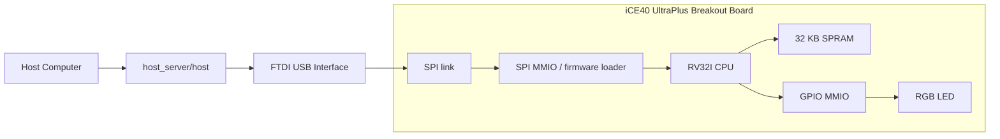

# iCE40up5K_riscv

RISC-V (`rv32i`) soft CPU for the Lattice iCE40 UltraPlus Breakout Board, based on the `riscv` sample from [damdoy/ice40_ultraplus_examples](https://github.com/damdoy/ice40_ultraplus_examples).

This fork keeps the original idea and architecture:

- a simple RV32I CPU
- 32 KB SPRAM
- memory-mapped GPIO for the RGB LED
- memory-mapped SPI link to a host computer

The current version has been debugged on real hardware and is now working end-to-end.

## Verified Status

The following flow has been confirmed on hardware:

- bitstream programming
- firmware upload over SPI
- CPU start from host command
- RGB LED control
- `pow(125) = 15625`
- `fib(20) = 6765`
- 2x2 matrix multiplication result `20, 4, 35, 2`

Example host output:

```text
calulating 125^2 read: 15625, status: 0xc0
calculating fib(20) read: 6765, status: 0xc0
received 20, status: 0xc0
received 4, status: 0xc0
received 35, status: 0xc0
received 2, status: 0xc0
```

### Functional wiring diagram



### Bring-up checklist

1. Program `blink` first to confirm the board and LED pins are correct.
2. Program `selftest` next to validate CPU, ROM, and GPIO without SPI.
3. Program `spi_debug` to validate firmware upload and `START_CPU`.
4. Program the production `top` bitstream after the debug path is confirmed.

## Repository Layout

- `riscv/`: production top, CPU, memory, firmware loader
- `riscv/tests/`: blink, timer debug, SPI debug, self-test tops and ROM
- `riscv/host_server/`: host utility and RISC-V firmware
- `spi/`: SPI slave and shared FTDI host library
- `common/`: board constraint file

## Quick Start

### 1. Build and program the production bitstream

```sh
cd riscv
make clean build
make prog
```

### 2. Build the firmware

```sh
cd host_server/firmware
make clean
make
```

### 3. Build and run the host utility

```sh
cd ..
make clean
make
./host
```

## Toolchain Notes

### FPGA toolchain

This project uses the open-source iCE40 flow:

- `yosys`
- `nextpnr-ice40`
- `icepack`
- `iceprog`

### RISC-V firmware toolchain

This repository uses `riscv64-unknown-elf-*` tools with `-march=rv32i -mabi=ilp32`.

That is intentional: Homebrew and several newer toolchains ship the 64-bit prefix, while still supporting RV32 targets.

### Host FTDI library

The host build detects `libftdi1` or `libftdi` via `pkg-config`.

## Debug Builds

Several hardware debug tops were added to make bring-up and regression checks easier.

### Blink test

Confirms basic FPGA programming and LED wiring.

```sh
cd riscv
make clean blink
make prog_blink
```

### Timer debug

`make timer_debug` は現状 `CPU=simple` の場合のみビルド成功します。
`CPU=picorv32` では合成は通りますが、配置配線で失敗します。

例:

```sh
make clean debug CPU=simple
make prog_debug
```

### Self-test

Runs a tiny ROM program embedded in the bitstream, without SPI firmware loading.

```sh
make clean selftest
make prog_selftest
```

Expected result:

- blue during reset
- red after reset release

This confirms:

- CPU instruction fetch
- decode/execute
- ROM timing
- GPIO MMIO

## UART MMIO

The production `top.v` build and `tests/top_spi_debug.v` expose a UART console at `115200 8N1` when built with `CPU=simple`.

`CPU=picorv32` does not support the UART path in this repository. Keep using the previous no-UART configuration for `picorv32`.

- `0x8200`: status (`bit0=RX ready`, `bit1=TX busy`, `bit2=RX overflow`, `bit3=TX FIFO full`)
- `0x8204`: RX data
- `0x8208`: TX data
- `0x820c`: control (`bit0=1` clears RX overflow)

Pins use `UART_TX=12`, `UART_RX=4`.

Available firmware examples:

- `host_server/firmware/uart_tx_test.c`: sends `HELLO\r\n` periodically
- `host_server/firmware/uart_echo.c`: 1-byte UART echo

Typical flow:

```sh
cd riscv
make clean build CPU=simple
make prog
```

```sh
cd host_server/firmware
make clean
make PROGRAM=uart_tx_test
make PROGRAM=uart_echo
```

```sh
cd ..
make clean
make
./host -f ./firmware/uart_tx_test --load-only
```

Expected result:

- `HELLO` repeats on the UART terminal roughly every 5 seconds

Then try echo mode:

```sh
./host -f ./firmware/uart_echo --load-only
```

After that, connect a UART terminal at `115200 8N1` and talk to the FPGA over
`UART_RX/UART_TX`.

Wiring:

- USB-UART `RX` -> FPGA `UART_TX` (`pin 12`)
- USB-UART `TX` -> FPGA `UART_RX` (`pin 4`)
- GND common

If you need to isolate the hardware UART path without involving the CPU or SPI loader, `tests/top_uart_tx_test.v` is kept as a pure FPGA-side UART TX test.

### SPI debug

Confirms firmware upload and CPU start over SPI.

```sh
make clean spi_debug
make prog_spi_debug
cd host_server/firmware && make clean && make
cd .. && make clean && make
./host
```

Expected LED sequence:

- blue: waiting for `START_CPU`
- purple: firmware loaded, CPU still held in reset
- red: CPU started and firmware-controlled GPIO is working

## Memory Map

```text
RAM   : 0x0000 - 0x7fff
SPI   : 0x8000 - 0x80ff
GPIO  : 0x8100 - 0x81ff
UART  : 0x8200 - 0x82ff
```

## SPI Commands

```text
0x0  NOP
0x1  INIT
0x2  SEND_FIRMWARE (16-bit chunks, auto-incrementing address)
0x3  START_CPU
0x4  SET_LED
0x5  RUN_GRADIENT
0x6  FIBONACCI
0x7  POW
0x8  MATRIX_MULT
```

## Changes From Upstream `damdoy/ice40_ultraplus_examples`

This repository started from the upstream `riscv` sample and adds both portability fixes and hardware-debugging fixes.

### Build and portability changes

- switched firmware build from `riscv32-unknown-elf-*` to configurable `riscv64-unknown-elf-*`
- made the firmware build freestanding with `-nostdlib` and `-lgcc`
- updated the host build to use `pkg-config` for `libftdi1` / `libftdi`
- simplified the RTL build inputs to this repository layout

### New debug infrastructure

- moved `top_blink.v` under `tests/`
- moved `top_timer_debug.v` under `tests/`
- moved `top_spi_debug.v` under `tests/`
- moved `top_selftest.v` under `tests/`
- moved `rom.v` under `tests/` for CPU-only ROM self-test
- added make targets for `blink`, `debug`, `spi_debug`, and `selftest`

### Hardware fixes

- fixed top-level startup issues caused by uninitialized control registers
- initialized `cpu_read_req_buf` so the first instruction fetch is not missed on real FPGA hardware
- initialized and default-cleared GPIO read-side control signals
- fixed self-test ROM reset/init handling
- held SPI logic in reset during CPU-only self-test

### SPI / firmware-path fixes

- stabilized SPI packet handoff
- fixed firmware write acknowledge handling in the top-level path
- kept firmware words from being silently overwritten or dropped during transfer
- added firmware-side pacing for `assert_read` and write-buffer availability

### Firmware updates

- fixed LED color encoding
- removed the unnecessary `math.h` dependency
- kept software multiply working through `libgcc`
- verified `pow`, `fib`, and matrix-multiply commands on hardware

## Current Result

Compared with the upstream sample, this fork is focused on:

- reproducible hardware bring-up
- real-board debug visibility
- modern macOS/Homebrew-friendly build flow
- confirmed end-to-end operation on the iCE40 UltraPlus Breakout Board
