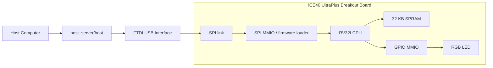

# iCE40up5K_riscv

RISC-V (`rv32i`) soft CPU for the Lattice iCE40 UltraPlus Breakout Board, based on the `riscv` sample from [damdoy/ice40_ultraplus_examples](https://github.com/damdoy/ice40_ultraplus_examples).

This fork keeps the original idea and architecture:

- a simple RV32I CPU
- 32 KB SPRAM
- memory-mapped GPIO for the RGB LED
- memory-mapped SPI link to a host computer

This tree also contains an experimental COMET II implementation that reuses the
same board, SPI loader, and host-communication ideas while exposing a 16-bit
word-addressed CASL II style machine.

The current version has been debugged on real hardware and is now working end-to-end.

## Verified Status

The following flow has been confirmed on hardware:

- bitstream programming
- firmware upload over SPI
- CPU start from host command
- RGB LED control
- `pow(125) = 15625`
- `fib(20) = 6765`
- 2x2 matrix multiplication result `20, 4, 35, 2`

Example host output:

```text
calulating 125^2 read: 15625, status: 0xc0
calculating fib(20) read: 6765, status: 0xc0
received 20, status: 0xc0
received 4, status: 0xc0
received 35, status: 0xc0
received 2, status: 0xc0
```

### Functional wiring diagram



### Bring-up checklist

1. Program `blink` first to confirm the board and LED pins are correct.
2. Program `selftest` next to validate CPU, ROM, and GPIO without SPI.
3. Program `spi_debug` to validate firmware upload and `START_CPU`.
4. Program the production `top` bitstream after the debug path is confirmed.

## Repository Layout

- `riscv/`: production top, debug tops, CPU, memory, firmware loader
- `riscv/host_server/`: host utility and RISC-V firmware
- `spi/`: SPI slave and shared FTDI host library
- `common/`: board constraint file

### COMET2-specific files

- `top_comet.v`: COMET II production top
- `comet2_cpu/`: COMET II core and 16-bit memory
- `comet2_selftest_rom.v`: ROM-based COMET II self-test program
- `comet2_cpu/spi_test/comet2_inout_main.bin`: SPI-loaded COMET II echo test image
- `host_server/comet2_inout_host.c`: host utility for COMET II IN/OUT testing

## Quick Start

### 1. Build and program the production bitstream

```sh
cd riscv
make clean build
make prog
```

### 2. Build the firmware

```sh
cd host_server/firmware
make clean
make
```

### 3. Build and run the host utility

```sh
cd ..
make clean
make
./host
```

## COMET II Quick Start

The COMET II path is kept separate from the original RISC-V build. Use
`CPU=comet2` to select it.

### 1. Build and program the COMET II bitstream

```sh
cd riscv
make clean
make CPU=comet2
make CPU=comet2 prog
```

### 2. Run the COMET II self-test

This self-test is ROM-based and does not require SPI firmware loading.

```sh
make clean selftest CPU=comet2
make prog_selftest
```

Expected result:

- blue during reset
- then RGB activity driven by the COMET II self-test ROM
- the ROM eventually executes `SVC 0`, reloads `SP`, and restarts

### 3. Run the COMET II IN/OUT echo test over SPI

This test loads a COMET II program over SPI, starts the CPU, then exchanges
characters with `SVC 1` / `SVC 2`.

```sh
make clean
make CPU=comet2
make CPU=comet2 prog
cd host_server
make comet2_inout_host
./comet2_inout_host
```

Expected host output:

```text
init..
init..
loaded firmware image: 332 bytes
sending: HELLO
echo[0] = 0x48 'H'
echo[1] = 0x45 'E'
echo[2] = 0x4c 'L'
echo[3] = 0x4c 'L'
echo[4] = 0x4f 'O'
echo[5] = 0x0a '.'
```

## Toolchain Notes

### FPGA toolchain

This project uses the open-source iCE40 flow:

- `yosys`
- `nextpnr-ice40`
- `icepack`
- `iceprog`

### RISC-V firmware toolchain

This repository uses `riscv64-unknown-elf-*` tools with `-march=rv32i -mabi=ilp32`.

That is intentional: Homebrew and several newer toolchains ship the 64-bit prefix, while still supporting RV32 targets.

### Host FTDI library

The host build detects `libftdi1` or `libftdi` via `pkg-config`.

## Debug Builds

Several hardware debug tops were added to make bring-up and regression checks easier.

### Blink test

Confirms basic FPGA programming and LED wiring.

```sh
cd riscv
make clean blink
make prog_blink
```

### Self-test

Runs a tiny ROM program embedded in the bitstream, without SPI firmware loading.

```sh
make clean selftest
make prog_selftest
```

Expected result:

- blue during reset
- red after reset release

This confirms:

- CPU instruction fetch
- decode/execute
- ROM timing
- GPIO MMIO

For `CPU=comet2`, the self-test uses `comet2_selftest_rom.v` instead of the
RISC-V ROM image and exercises COMET II reset-vector boot plus GPIO writes.

### SPI debug

Confirms firmware upload and CPU start over SPI.

```sh
make clean spi_debug
make prog_spi_debug
cd host_server/firmware && make clean && make
cd .. && make clean && make
./host
```

Expected LED sequence:

- blue: waiting for `START_CPU`
- purple: firmware loaded, CPU still held in reset
- red: CPU started and firmware-controlled GPIO is working

## Memory Map

```text
RAM   : 0x0000 - 0x7fff
SPI   : 0x8000 - 0x80ff
GPIO  : 0x8100 - 0x81ff
```

## COMET II Notes

The COMET II implementation uses a separate 16-bit word-addressed view of the
system.

### COMET II assumptions used in this repository

- little-endian CPU
- `SVC` uses the low byte of its operand as a vector number
- `SVC 0` is treated as reset-like control flow
- reset vector is loaded from memory word `0x0000`
- initial `SP` is loaded from memory word `0x001f`
- `SVC 1` and `SVC 2` are used by the IN/OUT test program

### COMET II memory map

```text
Main memory : 0x0000 - 0xbfff   (16-bit word addresses)
SPI MMIO    : 0xc000 - 0xc0ff
GPIO MMIO   : 0xc100 - 0xc1ff
```

### COMET II SPI MMIO convention used by the echo test

```text
0xC000  SPI status
0xC001  RX packet low word
0xC002  RX packet high word
0xC003  RX acknowledge / assert-read
0xC004  TX packet low word
0xC005  TX packet high word / commit
```

The COMET II echo sample uses:

- host -> COMET : opcode `0x10`, ASCII byte payload
- COMET -> host : opcode `0x20`, ASCII byte payload

## SPI Commands

```text
0x0  NOP
0x1  INIT
0x2  SEND_FIRMWARE (16-bit chunks, auto-incrementing address)
0x3  START_CPU
0x4  SET_LED
0x5  RUN_GRADIENT
0x6  FIBONACCI
0x7  POW
0x8  MATRIX_MULT
```

## Changes From Upstream `damdoy/ice40_ultraplus_examples`

This repository started from the upstream `riscv` sample and adds both portability fixes and hardware-debugging fixes.

### Build and portability changes

- switched firmware build from `riscv32-unknown-elf-*` to configurable `riscv64-unknown-elf-*`
- made the firmware build freestanding with `-nostdlib` and `-lgcc`
- updated the host build to use `pkg-config` for `libftdi1` / `libftdi`
- simplified the RTL build inputs to this repository layout

### New debug infrastructure

- added `top_blink.v`
- added `top_timer_debug.v`
- added `top_spi_debug.v`
- added `top_selftest.v`
- added `rom.v` for CPU-only ROM self-test
- added make targets for `blink`, `debug`, `spi_debug`, and `selftest`

### Hardware fixes

- fixed top-level startup issues caused by uninitialized control registers
- initialized `cpu_read_req_buf` so the first instruction fetch is not missed on real FPGA hardware
- initialized and default-cleared GPIO read-side control signals
- fixed self-test ROM reset/init handling
- held SPI logic in reset during CPU-only self-test

### SPI / firmware-path fixes

- stabilized SPI packet handoff
- fixed firmware write acknowledge handling in the top-level path
- kept firmware words from being silently overwritten or dropped during transfer
- added firmware-side pacing for `assert_read` and write-buffer availability
- fixed COMET II SPI MMIO halfword selection so `C002` reads do not corrupt
  later status reads

### Firmware updates

- fixed LED color encoding
- removed the unnecessary `math.h` dependency
- kept software multiply working through `libgcc`
- verified `pow`, `fib`, and matrix-multiply commands on hardware

## Current Result

Compared with the upstream sample, this fork is focused on:

- reproducible hardware bring-up
- real-board debug visibility
- modern macOS/Homebrew-friendly build flow
- confirmed end-to-end operation on the iCE40 UltraPlus Breakout Board
